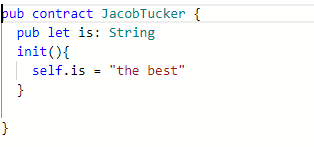
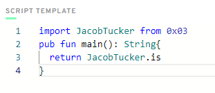
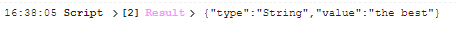

# Chapter 2 Day 1

1.Deploy a contract to account 0x03 called "JacobTucker". Inside that contract, declare a constant variable named is, and make it have type String. Initialize it to "the best" when your contract gets deployed.

2.Check that your variable is actually equals "the best" by executing a script to read that variable. Include a screenshot of the output.

## Creating the smart contract named "Jacob Tucker"



So in the image above we have created the contract and then created the constant named "is" of the type string and then we have assinged it the value "the best", we initialize the variable inside the init function using the keyword self.

## Creating the script to view Jacob Tucker smart contract



In order to check whether the variable is actually equals to "the best" we need to use a script on which we have imported the contract from the specified address and then declare the function and also the return type of the function, and lastly we need to call it. 

After executing the script we can see that the result shows that the constant is of the type string and the value is equal to "the best"




# Chapter 2 Day 2

## 1.Explain why we wouldn't call changeGreeting in a script.

A script is only used to view data, and cannot make changes to the data in the blockchain, meanwhile transactions are allowed to change data on te blockchain so they can access and modify data, meanwhile a script can only view data and not modify data on blockchain

```cadence
pub contract HelloWorld { 
    pub var greeting: String
   
    pub fun changeGreeting(newGreeting: String){
    self.greeting = newGreeting
        }
   
    init(){
        self.greeting = "Hello, World!"
    }
}
```

## 2.What does the AuthAccount mean in the prepare phase of the transaction?

In flow blockchain the data is stored in accounts so the role of AuthAccount is to access the data that is stored in the specific account, basically every time a user wants to make a transaction AuthAccount accesses the data stored on that specific account.

##3.What is the difference between the prepare phase and the execute phase in the transaction?

Basically prepare is the phase when the data is accessed and the transaction is approved by the user meanwhile in execute we call the specific functions for the data that we want to change. So prepare is access data and execute is the logic of changing the data

