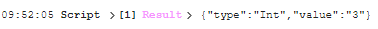
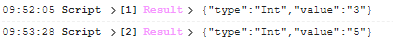
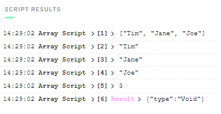
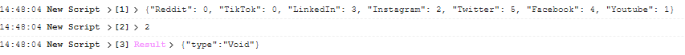
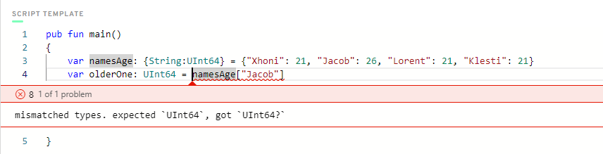
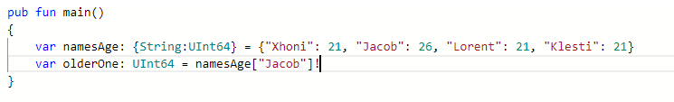
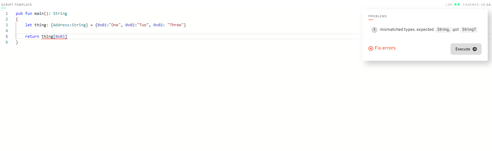

# Chapter 2 Day 1

1.Deploy a contract to account 0x03 called "JacobTucker". Inside that contract, declare a constant variable named is, and make it have type String. Initialize it to "the best" when your contract gets deployed.

2.Check that your variable is actually equals "the best" by executing a script to read that variable. Include a screenshot of the output.

## Creating the smart contract named "Jacob Tucker"


So in the image above we have created the contract and then created the constant named "is" of the type string and then we have assinged it the value "the best", we initialize the variable inside the init function using the keyword self.

## Creating the script to view Jacob Tucker smart contract


In order to check whether the variable is actually equals to "the best" we need to use a script on which we have imported the contract from the specified address and then declare the function and also the return type of the function, and lastly we need to call it. 

After executing the script we can see that the result shows that the constant is of the type string and the value is equal to "the best"


# Chapter 2 Day 2

## 1.Explain why we wouldn't call changeGreeting in a script.

A script is only used to view data, and cannot make changes to the data in the blockchain, meanwhile transactions are allowed to change data on te blockchain so they can access and modify data, meanwhile a script can only view data and not modify data on blockchain

```cadence
pub contract HelloWorld { 
    pub var greeting: String
   
    pub fun changeGreeting(newGreeting: String){
    self.greeting = newGreeting
        }
   
    init(){
        self.greeting = "Hello, World!"
    }
}
```

## 2.What does the AuthAccount mean in the prepare phase of the transaction?

In flow blockchain the data is stored in accounts so the role of AuthAccount is to access the data that is stored in the specific account, basically every time a user wants to make a transaction AuthAccount accesses the data stored on that specific account.

## 3.What is the difference between the prepare phase and the execute phase in the transaction?

Basically prepare is the phase when the data is accessed and the transaction is approved by the user meanwhile in execute we call the specific functions for the data that we want to change. So prepare is access data and execute is the logic of changing the data

## 4. Add two new things inside your contract:

    •A variable named myNumber that has type Int (set it to 0 when the contract is deployed)
    •A function named updateMyNumber that takes in a new number named newNumber as a parameter that has type Int and updates myNumber to be newNumber
    
 ```cadence
 pub contract HelloWorld { 
   
    pub var greeting: String
    pub var myNumber: Int
   
    pub fun changeGreeting(newGreeting: String){
    self.greeting = newGreeting
        }
   
    pub fun updateMyNumber(newNumber: Int){
        self.myNumber = newNumber
    }

    init(){
        self.myNumber = 3
        self.greeting = "Hello, World!"
    }
}
 ```
 NOTE: In my case I choosed to initialize the string to 3

    •Add a script that reads myNumber from the contract
    
```cadence
 import HelloWorld from 0x01

pub fun main(): Int{
  return HelloWorld.myNumber
}
```


 
    •Add a transaction that takes in a parameter named myNewNumber and passes it into the updateMyNumber function. Verify that your number changed by running the   script again.
    
 ```cadence
    transaction(myNewNumber: Int)
    {
  prepare(acct: AuthAccount){}

  execute
  {
    HelloWorld.updateMyNumber(newNumber: myNewNumber)
  }

}
```
    

 
 
 
 # Chapter 2 Day 3
 
 ## 1. In a script, initialize an array (that has length == 3) of your favourite people, represented as Strings, and log it.
 
 ```cadence
 pub fun main(){
    var favoritePeople: [String] = ["Tim", "Jane", "Joe"]
    log(favoritePeople) // we can log the entire array or log them one by one
    log(favoritePeople[0]) //Tim
    log(favoritePeople[1]) //Jane
    log(favoritePeople[2]) //Joe
    log(favoritePeople.length) //Using built-in function lenth we log the length to the console
}
 ```
 
 
 
 ## 2. In a script, initialize a dictionary that maps the Strings Facebook, Instagram, Twitter, YouTube, Reddit, and LinkedIn to a UInt64 that represents the order in which you use them from most to least. For example, YouTube --> 1, Reddit --> 2, etc. If you've never used one before, map it to 0!

```cadence
pub fun main()
{
    var socialMedia: {String:UInt64} = {"Youtube": 1, "Instagram": 2, "LinkedIn": 3, "Facebook": 4, "Twitter": 5, "Reddit": 0, "TikTok": 0}
    log(socialMedia)
    log(socialMedia["Instagram"])
}
```
 
 
 ## 3. Explain what the force unwrap operator ! does, with an example

In the example above we have created a dictionary with keys string and value ages of the type UInt64 which means only positive values and the size 64 bit, Values of dictionary by default have the optional operator ?, but we want to assign the value of the older person in a list to a UInt64 variable named olderOne, but when we do that we get the following error



So how do we solve the above error? We have another operator in cadence which is called the force unwrap operator which checks if the value is nil, it aborts the program, and if the value is UInt64 it removes the optional operator and the program will continue to execute.



## 4. Using this picture below, explain...
    What the error message means
    Why we're getting this error
    How to fix it


This quest is very similar to the quest three example above but in this case the main function returns a string and it's not of the type void, we are trying to return a the string value of the address, but in dictionaries the type of values always have the optional operator which means in our case that it can be string or it can nil, and as stated above we solve this error by using force unwrap operator which checks if it is string remove optional operator and continue and if it is not string abort the program. 
```cadence
pub fun main(): String
{
    let thing: {Address:String} = {0x01:"One", 0x02:"Two", 0x02: "Three"}

    return thing[0x03]!
}
```
Or the another solution is that we can change our function from expecting string to excpecting string with optional operator like is shown below and we will not have mismatched types.
```cadence
pub fun main(): String?
{
    let thing: {Address:String} = {0x01:"One", 0x02:"Two", 0x02: "Three"}

    return thing[0x03]
}
```


 # Chapter 2 Day 4
 
 1. Deploy a new contract that has a Struct of your choosing inside of it (must be different than Profile).

 2. Create a dictionary or array that contains the Struct you defined.

 3. Create a function to add to that array/dictionary.

```Cadence

//We have created a new contract called myWallet 
pub contract myWallet
{
  //We have created a dictionary which stores the information about many wallets based on the walletName
  pub var Wallets: {String: Cryptos}

  //We have created a struct where we have defined the information that we will store about each wallet
  pub struct Cryptos {
    pub var bitcoin: UInt64
    pub var monero: UInt64
    pub var dogecoin: UInt64
    pub var shiba: UInt64
    pub var etherium: UInt64
    pub var walletName: String
    
    init(_bitcoin: UInt64, _monero: UInt64, _dogecoin: UInt64, _shiba: UInt64, _etherium: UInt64, _walletName: String)
    {
      self.bitcoin = _bitcoin
      self.monero = _monero
      self.dogecoin = _dogecoin
      self.shiba = _shiba
      self.etherium = _etherium
      self.walletName = _walletName
    }
  }

  //We have created a function named addWallet which creates a new wallet with the necessary information
  pub fun addWallet(bitcoin: UInt64, monero: UInt64, dogecoin: UInt64, shiba: UInt64, etherium: UInt64, walletName: String)
  {
    let newWallet = Cryptos(_bitcoin: bitcoin, _monero: monero, _dogecoin: dogecoin, _shiba: shiba, _etherium: etherium, _walletName: walletName) 
    self.Wallets[walletName] = newWallet // Adding the new wallet to the dictionary
  }
  init()
  {
    self.Wallets = {}
  }
}
```

 4. Add a transaction to call that function in step 3.
 
 ```cadence
//Importing the contract from the user we have deployed
import myWallet from 0x02

//Creating a transaction with the necessary parameters asked by the addWallet function
transaction(bitcoin: UInt64, monero: UInt64, dogecoin: UInt64, shiba: UInt64, etherium: UInt64, walletName: String)
{
    prepare(signer: AuthAccount){}
    execute
    {
      myWallet.addWallet(bitcoin: bitcoin, monero: monero, dogecoin: dogecoin, shiba: shiba, etherium: etherium, walletName: walletName)
      log("Wallet is created")
    }
}
 ```
 
  5. Add a script to read the Struct you defined.
  
  ```cadence
  //Importing the contract from the user we have deployed
import myWallet from 0x02

//Creating a function which accepts wallet name as a parameter which our key in the dictionary and return the type Cryptos which is the struct that we defined in the contract
pub fun main(walletName: String): myWallet.Cryptos
{
    return myWallet.Wallets[walletName]! //NOTE: We have used force unwrap operator avoid mismatched type
} 
  ```
  
  ### Result
{"type":"Struct","value":{"id":"A.0000000000000002.myWallet.Cryptos","fields":[{"name":"bitcoin","value":{"type":"UInt64","value":"3"}},{"name":"monero","value":{"type":"UInt64","value":"3"}},{"name":"dogecoin","value":{"type":"UInt64","value":"4"}},{"name":"shiba","value":{"type":"UInt64","value":"6"}},{"name":"etherium","value":{"type":"UInt64","value":"7"}},{"name":"walletName","value":{"type":"String","value":"Xhoni"}}]}}
